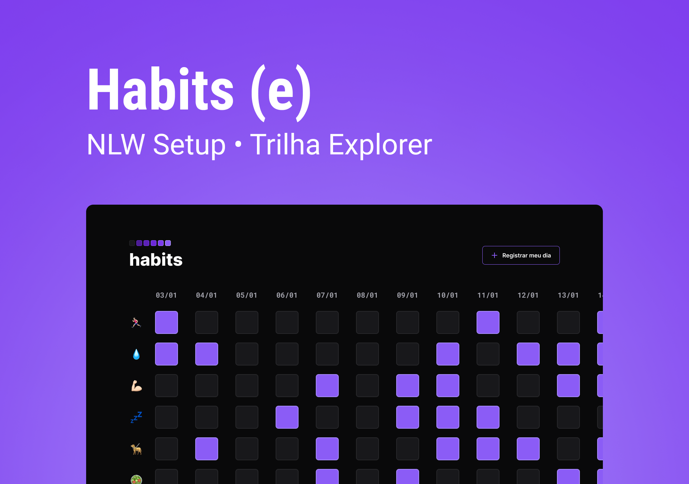

## NLW Setup

Evento realizado pela rockseat, totalmento gratuito. NLW Setup é uma aplicação web para controle de hábitos

## Tecnologias usadas

- HTML
- CSS
- JAVASCRIPT
- GIT 
- GITHUB
- FIGMA

[Acesse o projeto no figma](https://www.figma.com/file/x4456ulRF5t15vtl2QtGxR/Habits-(e)-(Community)?node-id=6%3A344&t=Go9y0JLnwWnjHkvB-0)
Lembrando que é necessário ter conta no figma [Abrir conta no figma](https://www.figma.com
)